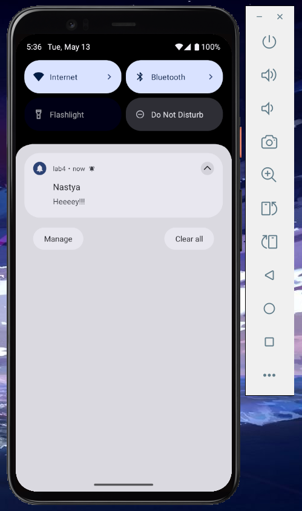

# Лабораторна робота №4

## Тема: Робота з push-сповіщеннями у React Native за допомогою Firebase та OneSignal

## Мета роботи

- Ознайомитись із принципами інтеграції push-сповіщень у мобільні застосунки (Android).
- Навчитись створювати, планувати та скасовувати відкладені сповіщення за допомогою OneSignal.
- Реалізувати просту систему завдань з нагадуванням.

## Опис роботи

Було створено мобільний додаток "To-Do Reminder" на React Native. Для реалізації push-сповіщень використано OneSignal, а для вибору дати та часу — datetime picker.

При додаванні нової задачі користувач вказує:

- Ім'я
- Опис
- Дату та час нагадування

Заплановане сповіщення надсилається через OneSignal у вказаний користувачем час. Також реалізовано можливість видаляти завдання, що автоматично скасовує відповідне сповіщення.

## Скріншоти роботи застосунку

### Додавання нагадування (datetime picker)

### Push-сповіщення у верхній панелі

### Список завдань з нагадуваннями

### Список OneSignal

## Автор

- **Козік Анастасія Ігорівна**, студентка групи ВТк-24-1
